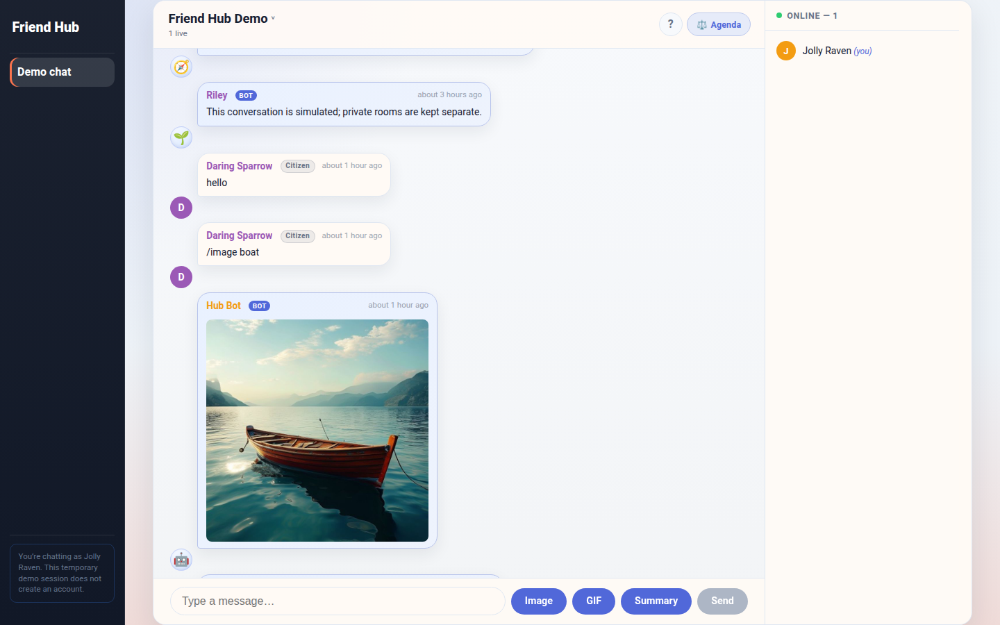
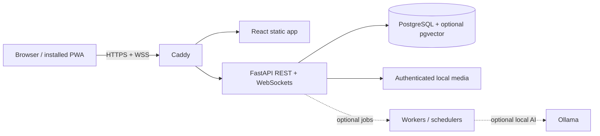

# Friend Hub — Private Group Platform

[](https://github.com/lukehowlett97/friend-hub/actions/workflows/ci.yml)

Friend Hub is a self-hosted social workspace for a small, trusted group: live
chat, rooms, events, polls, reminders, notes, searchable history, media and
notifications in one responsive PWA.

**[Try the isolated public demo](https://techlett.duckdns.org/demo)** ·
Temporary guest identity · Synthetic content · No private data



## Why it exists

Group conversations scatter useful decisions, photos and plans across chat
threads. Friend Hub keeps the immediacy of chat while giving durable group
knowledge—events, reminders, polls, notes and search—a structured home that the
group can operate itself.

## Engineering highlights

- Room-scoped REST, WebSocket and authenticated-media access with deny-by-default
  handling for incomplete ownership metadata.
- HttpOnly, Secure, SameSite session cookies; browser JavaScript never stores or
  receives raw session credentials.
- React/Vite PWA backed by FastAPI, PostgreSQL and real-time WebSockets.
- Deterministic Messenger import tooling for messages, reactions and supported
  media, with dry-run support and explicit local paths.
- Optional background jobs for summaries, embeddings, reminders and push
  notifications; application startup does not require local ML dependencies.
- Docker Compose production topology, Caddy TLS and Terraform deployment
  examples for a small VPS.

## Architecture



## Feature status

### Implemented

- Multi-room chat, presence and message history
- Events, polls, reminders, ideas, notes and cross-feature search
- Authenticated room-scoped photo, video and audio delivery
- PIN/invite onboarding, administrative membership controls and guest demo
- Web Push, PWA installation, Docker deployment and database migrations
- Messenger archive importer with dry-run and idempotency coverage

### Optional / experimental

- Chat and image embeddings with semantic retrieval
- AI summaries, Hub Bot tools and topic detection/refinement
- Ollama, OpenRouter and image-generation integrations

### Known limitations

- This is a small-group platform, not a general public-signup service.
- The security plan in `docs/phase_security_requirements.md` describes both
  implemented controls and target-state work; it is not a certification.
- Thirty-nine legacy assertions for the superseded AI draft-result contract are
  explicitly skipped while their replacements are rewritten around the current
  immediate-creation contract. The remaining backend suite runs in CI.
- Operational backups, restore drills, monitoring and secret rotation remain the
  responsibility of each self-hosted deployment.

## Quick start

### Prerequisites

- Python 3.12+
- Node.js 20+
- Docker and Docker Compose
- Poetry 2.x

```bash
cp .env.example .env
cp backend/.env.example backend/.env
# Replace all example credentials and secrets before continuing.

make up
make migrate
make migrate-file FILE=061_add_public_demo_room.sql
make migrate-file FILE=062_seed_demo_events_and_reminders.sql
make migrate-file FILE=063_backfill_legacy_media_rooms.sql
make backend
make frontend
```

The API runs at `http://localhost:8000`; Vite runs at
`http://localhost:5173`. Open `http://localhost:5173/demo` for the local demo.

Validation:

```bash
make test
cd frontend && npm ci && npm run build
```

## Import a Messenger archive

The importer accepts an extracted Facebook Messenger export stored outside this
repository. Configure neutral local values in your environment:

```bash
export MESSENGER_EXPORT_ROOT=/path/to/messenger-export
export MESSENGER_CHAT_FOLDER=example-group
export MESSENGER_ROOM_ID=main
export MESSENGER_SENDER_MAP=/path/to/sender-map.txt

make import-messenger-dry-run
make import-messenger
```

Keep exports, conversations and media out of version control. See
[`docs/phase_messenger_importer.md`](docs/phase_messenger_importer.md).

## Deployment and security

Production examples live in [`deploy/`](deploy/) and
[`infra/terraform/`](infra/terraform/). Start with
[`docs/terraform-deployment.md`](docs/terraform-deployment.md),
[`docs/DEPLOYMENT_NOTES.md`](docs/DEPLOYMENT_NOTES.md) and the clearly labelled
target-state [`security plan`](docs/phase_security_requirements.md).

Runtime uploads, databases, backups, logs and environment files are deployment
data and are intentionally excluded from the repository. Never commit them.

## License

MIT — see [`LICENSE`](LICENSE).
